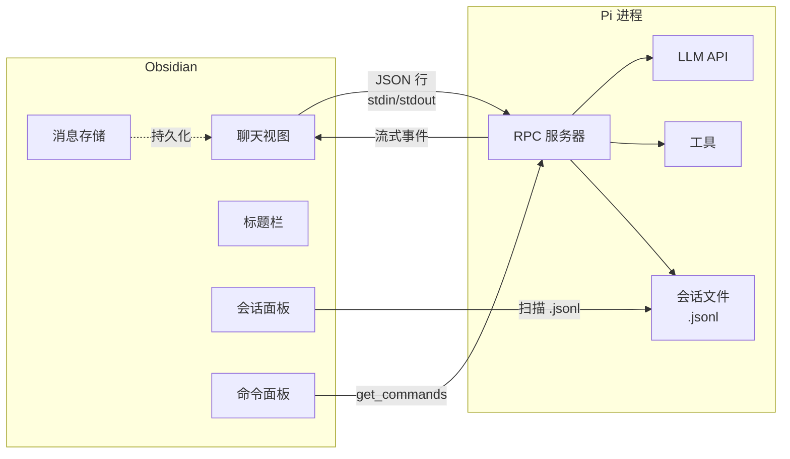

# Pi Plugin for Obsidian

在 Obsidian 中与 [Pi 编程助手](https://github.com/earendil-works/pi/tree/main/packages/coding-agent)对话。对话内容以原生 Obsidian Markdown 格式渲染，完整支持代码高亮、Mermaid 图表、callout 引用块和 wiki 链接。

> **仅支持桌面端。** 需要本地安装 Pi（`npm i -g @earendil-works/pi-coding-agent`）。

[English](README.md) | **中文**

## 功能特性

### 聊天视图
- 完整流式输出，实时 Markdown 渲染
- 思考块（可展开，回复开始时自动折叠）
- 工具调用结果以可折叠详情展示
- 聊天历史记录支持原生文本选择
- 引导消息——在助手工作时发送以重定向
- 中止按钮，可随时取消流式输出
- 图片粘贴支持（base64）
- 通过 `@` 选择器添加文件附件

### 会话管理
- **标题栏**——显示会话名称（点击重命名）、模型、思考级别和工作目录
- **会话侧边栏**——浏览、搜索、切换、删除和导出 Pi 原生 `.jsonl` 会话
- **消息持久化**——切换会话和插件重启后聊天历史记录依然保留
- **自动保存**——关闭时将对话以 Markdown 笔记形式自动保存到库中
- **新建会话**按钮，自动保存当前对话

### 命令集成
- 在聊天输入框中输入 `/` 打开命令选择器，显示 Pi 可用的命令
- Pi 命令已注册到 Obsidian 的命令面板（`Ctrl+P` → `Pi: /命令名称`）
- 命令按来源分组（skill、extension、prompt template）
- 每次连接时重新获取命令（项目作用域）

### 模型切换
- `Pi: Switch model` 命令可从可用模型中选择
- 模型和思考级别显示在标题栏和状态栏中

### 状态栏
- 一目了然地查看会话名称、模型、Token 用量和费用
- 流式输出状态指示

## 安装

1. 全局安装 [Pi](https://github.com/earendil-works/pi/tree/main/packages/coding-agent)
2. 克隆或下载本仓库
3. 运行 `npm install && npm run build`
4. 将 `main.js`、`styles.css` 和 `manifest.json` 复制到你库中的 `.obsidian/plugins/pi-plugin/` 目录
5. 在 Obsidian → 设置 → 社区插件中启用 "Pi"

### 设置项

| 设置项 | 默认值 | 说明 |
|---------|---------|-------------|
| Pi 可执行文件路径 | `pi` | Pi 可执行文件的路径 |
| 工作目录 | 库根目录 | Pi 的工作目录 |
| 默认提供商 | （Pi 默认值） | LLM 提供商（anthropic、openai、google 等） |
| 默认模型 | （Pi 默认值） | 模型名称 |
| 会话保存目录 | `Pi-Sessions` | 保存对话的库目录 |
| 持久化会话 | `true` | 自动将对话保存为库笔记 |
| 思考级别 | `medium` | 推理级别（none、low、medium、high） |

## 架构

插件通过 Pi 的 [RPC 模式](https://github.com/nicholasgasior/pi-coding-agent/blob/main/docs/rpc.md) 与 Pi 通信——启动 `pi --mode rpc --no-session` 进程，通过 stdin/stdout 交换 JSON 行。



### 核心模块

| 文件 | 用途 |
|------|---------|
| `src/rpc.ts` | 启动 Pi 进程，JSON 行协议，请求/响应关联 |
| `src/view.ts` | 聊天视图——标题栏、消息、输入框、会话面板集成 |
| `src/stream-handler.ts` | 将 RPC 事件处理为 ChatMessage（文本增量、工具调用、思考） |
| `src/renderer.ts` | 将消息渲染为 Obsidian Markdown |
| `src/session-scanner.ts` | 读取 Pi 原生 `.jsonl` 会话文件 |
| `src/session-panel.ts` | 会话浏览器侧边栏 |
| `src/session-list.ts` | 会话列表模态框，用于浏览已保存的对话 |
| `src/message-store.ts` | 用于会话历史的持久化消息缓存 |
| `src/commands.ts` | `/` 命令建议和命令面板注册 |
| `src/input.ts` | 聊天输入框，支持自动调整大小、粘贴、附件 |
| `src/sessions.ts` | 将对话以 Markdown 库笔记形式保存/加载 |
| `src/statusbar.ts` | 状态栏，显示模型、Token、费用 |
| `src/settings.ts` | 插件设置 |

## 开发

```bash
npm install
npm run dev    # 监听模式
npm run build  # 生产构建，含类型检查
```

构建输出为仓库根目录下的 `main.js`。将其（连同 `styles.css` 和 `manifest.json`）复制到你库的插件目录即可测试。

## 许可证

MIT
